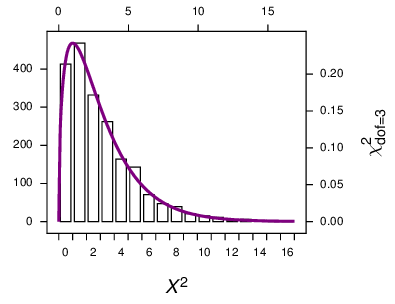
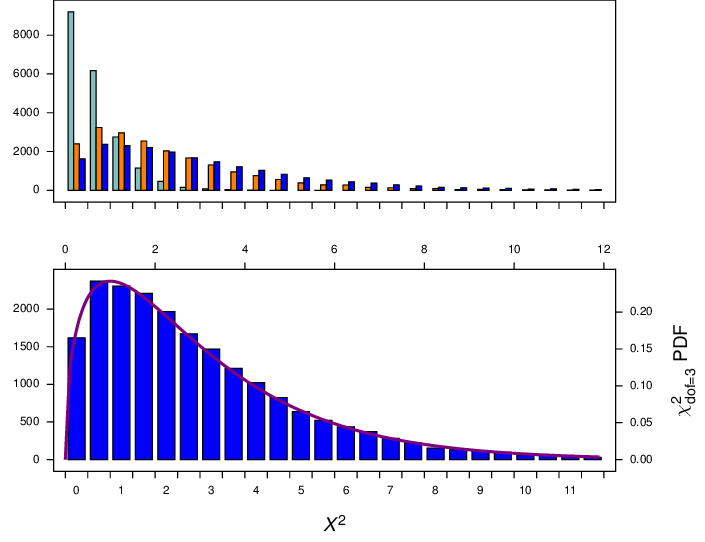
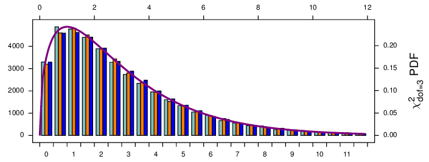
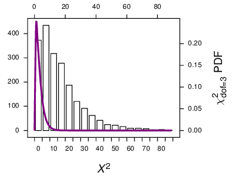
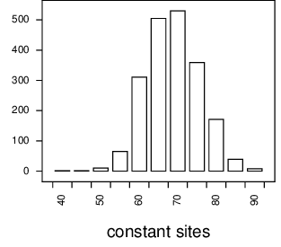
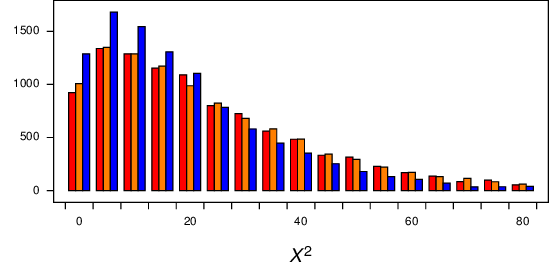
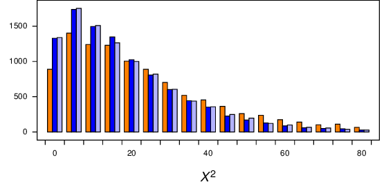
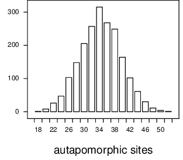
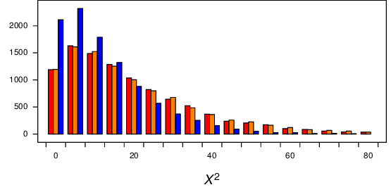

===========================================
Assessing partition composition differences
===========================================

.. _partitionCompositionDifferences:

- First made as a blurb 2010-11-13

- Revised for Sphinx 2016-05-30

Here we ask whether different data partitions of molecular sequence alignments
have different compositions --- a deceptively simple question.  It needs to be
answered using a model of evolution.

I use the :math:`X^2` statistic because it usefully reflects the heterogeneity in the
data.  However I find that I cannot validly use the :math:`\chi^2` curve as a null
distribution to assess the significance of that :math:`X^2`.  Rather I need to make a
null distribution using simulations, and making these null distributions is what
this explanation is about.
(Here I make a distinction between the :math:`X^2` statistic, using a capital :math:`\chi`,
calculated from an :math:`R \times C` table, and the :math:`\chi^2` curve that is used to
assess its significance.  I got that from Sokal and Rohlf.)

Testing whether two unrelated sequences have different compositions
-------------------------------------------------------------------

Asking whether two random unrelated DNA sequences have different compositions
can use the :math:`\chi^2` test.  The significance of the :math:`X^2` statistic can be
assessed with a :math:`\chi^2` curve with 3 degrees of freedom.  We can check whether
this is an appropriate null distribution by simulating many random sequence
pairs with the same composition and so get a null distribution of :math:`X^2` values;
these are values that we would expect when comparing unrelated sequences that
truly have the same composition.  Such a distribution was made as shown in  :numref:`fig-unrelated`. In this case, the
:math:`\chi^2_{\mathrm{dof}=3}` curve with 3 degrees of freedom would be appropriate
to assess the significance of the :math:`X^2` statistic.

.. _fig-unrelated:

    Null distribution of :math:`X^2` values from unrelated random sequences.  For each of 2000 replicates, two random DNA sequences were simulated, one of length 1079 and the other of 2023, both with expected composition of 0.4, 0.3, 0.2, 0.1 for A, C, G, and T.  The :math:`X^2` values were calculated and plotted here.  It fits closely with a :math:`\chi^2_{\mathrm{dof}=3}` probability density function.

So there are no surprises here. The :math:`\chi^2` works as it should for unrelated
sequences.  How does it work for pairs of sequences that are related on a
phylogenetic tree?

Testing whether two related sequences have different compositions
-----------------------------------------------------------------

Here I evolve a sequence on a two-branch tree using the JC model, making two sequences separated by some evolutionary distance.  Then I measure the :math:`X^2` statistic for the two sequences, plotted in   :numref:`fig-twoBranch`.  When the sequences are separated by a large evolutionary distance (blue bars) they become effectively unrelated, and the results are like that shown in  :numref:`fig-unrelated`, and becomes a good fit to a :math:`\chi^2_{\mathrm{dof}=3}` curve.  However, at smaller evolutionary distances, the :math:`X^2` values are smaller.

.. _fig-twoBranch:

    Sequences were evolved on a two branch tree with the Jukes-Cantor model, over total evolutionary distances of 0.2 (teal bars), 1.0 (orange bars), and 20 (blue bars).  The blue bar distribution is repeated by itself in the lower panel.  In both, the tail to the right was truncated.

Testing whether two related partitions have different compositions
------------------------------------------------------------------

Here I evolve a sequence on a two-branch tree using the JC model, making two sequences separated by some evolutionary distance (0.2, 1, and 20).  Then I measure the :math:`X^2` statistic for the first half *vs* the second half of the two sequences, separately (and so getting two :math:`X^2` for each simulation).  These are plotted in  :numref:`fig-twoBranchB`.  All the simulation distributions are about the same, and are a good fit to a :math:`\chi^2_{\mathrm{dof}=3}` curve (although there may be a very small branch-length related deviation from the :math:`\chi^2`?).

.. _fig-twoBranchB:

    Comparing related partitions.  Sequences were evolved on a two branch tree with the Jukes-Cantor model, over total evolutionary distances of 0.2 (teal bars), 1.0 (orange bars), and 20 (blue bars).  A tail of the distributions to the right was truncated.

However, things change when we have more sequences on a more complex tree.

Here I make a star tree with 11 taxa, with each branch 0.3 mutations per site.
The sequences are DNA, 200 bases long, that evolve under the Jukes-Cantor
model. After each simulation, I calculate the :math:`X^2` values from the 1100
characters of the first 100 sites compared to the 1100 characters of the second
100 sites.  These two partitions truly have the same composition, and so the
:math:`X^2` values would be a valid null distribution.  The results of 2000
simulations are shown in   :numref:`fig-star`.
The simulated values differ greatly from the :math:`\chi^2_{\mathrm{dof}=3}`
probability density function. 

.. note::

    Using the :math:`\chi^2` PDF in this case would not be appropriate for assessing the
    significance of the :math:`X^2` statistic.  It would be better to make a null
    distribution with simulations under the model.

.. _fig-star:

    Null distribution of :math:`X^2` values from equal partitions of sequences related on a star tree.  For each of 2000 replicates, 11 DNA sequences of length 200 were simulated on a star tree, and for the first half compared with the second half of the data.  The :math:`X^2` value was calculated and plotted here (bars).  The line plot shows the PDF.

Comparing constant with variable sites
--------------------------------------

Here the model, the tree, and data size that I use is the same as that above except that it includes a 4-category gamma distributed among site rate variation with shape of 0.5.  When I simulate data of 200 characters with that, the number of constant sites in the resulting alignment ranges from about 50 to about 90, as shown in   :numref:`fig-nConstSitesDistro`.

.. _fig-nConstSitesDistro:

    Distribution of the number of constant sites.  For each of 2000 replicates, 11 DNA sequences of length 200 were simulated on a star tree, and the number of constant sites counted and plotted.

How can we make a valid null distribution?  The data for which we want to make the comparison will have a certain number of constant sites, :math:`N_C`.  We want to make a valid null distribution with our tree, model, and data size, that would be appropriate for comparing the composition of the constant *vs* the variable sites of our alignment with the :math:`N_C` constant sites.   Here I test getting :math:`X^2` values from simulations with 3 different regimes,

Regime 1
    Do many simulations but only use the simulations where the number of constant sites in the simulation is equal to :math:`N_C`.  Here I arbitrarily chose :math:`N_C = 71`.

Regime 2
    Use all the simulations, comparing constant sites with variable sites

Regime 3
    Use all simulations, without distinguishing between constant and variable sites.  Compare the first half of the alignment with the second half.

As shown in   :numref:`fig-compare1`,  distributions from all three regimes all have similar distributions.  However, while the Regime 1 and 2 distributions (red and orange bars, respectively) appear to be about the same as each other, it appears that the Regime 3 distribution (blue bars) is slightly different.

.. _fig-compare1:

    Distribution of :math:`X^2` from simulations under regimes 1 (red bars), 2 (orange bars), and 3 (blue bars).  Alignment length was 200.   All three distributions have a long tail (up to about 180), which has been truncated here.

Thinking that the explanation for this difference was because the alignment was so short, I repeated the simulations with a long, 10000 - base alignment (for regimes 2 and 3; regime 1 was too slow).  However, I got the same difference, as shown in    :numref:`fig-compare1B` (orange bars *vs* blue bars), so the length of the sequences does not appear to affect things.  Thinking that the explanation might be that the two partitions compared might be different sizes (in regime 2 about 3500 of the 10000 sites were constant, while in regime 3 I compared equal sized partitions) I modified regime 3 for another distribution where I compared the first 3000 sites with the remaining 7000 sites in the alignment.  That distribution is shown in the light blue bars in   :numref:`fig-compare1B`.  It appears that makes no difference as well.

.. _fig-compare1B:

    Distribution of :math:`X^2` from simulations of long alignments (10000 characters) under regimes 2 (orange bars), and 3 (blue bars), and a modified regime 3 wheter the first 3000 positions was compared with the remaining 7000 positions(light blue).  All three distributions have a long tail (up to about 180), which has been truncated here.

Comparing autapomorphic sites with other variable sites
-------------------------------------------------------

Autapomorphic sites are sites with two different character states, where one character state appears only once; that is a constant site with a single character different.  If we simulate data sets as above (star tree, 200 characters long), we get a distribution of autapomorphiec sites is as shown in   :numref:`fig-nAutaposDist`.

.. _fig-nAutaposDist:

    Distribution of the number of autapomorphic sites when data were simulated on the star tree with among-site rate variation (see text).

We want to get a valid null distribution by which to evaluate any difference in composition between autapomorphic sites and the other variable sites.
As above, 3 different simulation regimes were done, as follows, where :math:`N_A` is the number of autapomorphies in the original data, which I will arbitrarily set to 30.

Regime 1
    Do many simulations but only use the simulations where the number of autapomorphies in the simulation is equal to :math:`N_A`.

Regime 2
    Use all the simulations, comparing autapomorphic sites to all other variable sites 

Regime 3
    Use all simulations, without distinguishing autapomorphies.  Compare the first half of the variable sites with the second half.

Results for these simulations are shown in   :numref:`fig-singletons`.  The distributions for the 3 regimes appear to be similar.  The fourth set of simulations are :math:`X^2` values from comparing the first half of the data with the second half, without partitioning into constant sites or singletons.  Even that distribution is similar to the others.

.. _fig-singletons:

    Comparison of null distributions of :math:`X^2` for comparisons of autapomorphic sites with other variable sites.  The red bars show regime 1, the orange bars show regime 2, and the blue bars show regime 3.

It looks like the distributions for the first two regimes are about the same, while the distribution for regime 3 differs. 

An example using the Cox *et al* 2008 data
------------------------------------------

Here I use the `Cox *et al* 2008 <http://www.ncbi.nlm.nih.gov/pubmed/19073919>`_ SSU and LSU rRNA gene alignment, including all sites (Cox *et al* stripped out constant sites and autapomorphies for the published analysis), and doing it in a Bayesian context.   A Bayesian run was made using MrBayes v3.2.2, for 2 million generations, using the GTR+IG model on the two partitions, unlinked.  The two runs appeared to converge well, with the ASDOSF about 0.01 -- 0.02, and PSRF values close to 1.0.  The second half of the samples were used for simulations to get null distributions by which to compare the constant *vs* variable, and autapomorphies *vs* other variable sites for both partitions.  Samples from both runs were used. (The consensus tree was the 3-domains tree).  Results are shown in   :numref:`tab-cox`, and show that for both genes the composition of the constant sites differs (at the 5% level) from that of the variable sites.  The composition of autapomorphies differs from the other variable sites in the LSU gene, but not in the SSU gene.

The simulations were done as described in this listing, saving the ``xSq`` values in a file called ``xSq``.

.. code-block:: python

    # Read in a tree with an attached model, as a pickled tree
    read('myTree.p4_tPickle')
    t = var.trees[0]

    # Read in some data.
    var.alignments = []
    var.doCheckForBlankSequences=False
    var.doCheckForDuplicateSequences=False
    read('ssu.nex')
    read('lsu.nex')
    aSsu = var.alignments[0]
    aLsu = var.alignments[1]
    d = Data()

    # Check to make sure its all good to go.
    # (This step is needed for empirical comps, at least)
    t.data = d
    t.calcLogLike(verbose=False)

    func.reseedCRandomizer(os.getpid())

    for myRunNum in [1,2]:
        # Instantiate
        ps = PosteriorSamples(t, runNum=myRunNum, program='mrbayes', mbBaseName='mbout', verbose=0)

        # # Iterate over samples
        for sampNum in range(1001,2001):
            t2 = ps.getSample(sampNum)
            t2.data = d
            t2.simulate()
            for a in [aSsu, aLsu]:
                mC = a.constantMask()
                mS = a.getMaskForAutapomorphies()
                mOV = a.orMasks(mC, mS)

                aC = a.subsetUsingMask(mC)
                aV = a.subsetUsingMask(mC, inverse=True)
                aS = a.subsetUsingMask(mS)
                aOV = a.subsetUsingMask(mOV, inverse=True)
                #print aOV.getCharDiversityDistribution()

                # Count characters in the four subsets, make xSq
                cC = [0] * 4
                for s in aC.sequences:
                    cc = [s.sequence.count(symb) for symb in aSsu.symbols]
                    for i in range(aSsu.dim):
                        cC[i] += cc[i]

                cV = [0] * 4
                for s in aV.sequences:
                    cc = [s.sequence.count(symb) for symb in aSsu.symbols]
                    for i in range(aSsu.dim):
                        cV[i] += cc[i]

                rByC = [cC, cV]
                xSq = func.xSquared(rByC)
                print xSq,

                cS = [0] * 4
                for s in aS.sequences:
                    cc = [s.sequence.count(symb) for symb in aSsu.symbols]
                    for i in range(aSsu.dim):
                        cS[i] += cc[i]

                cOV = [0] * 4
                for s in aOV.sequences:
                    cc = [s.sequence.count(symb) for symb in aSsu.symbols]
                    for i in range(aSsu.dim):
                        cOV[i] += cc[i]

                rByC = [cS, cOV]
                xSq = func.xSquared(rByC)
                print xSq,
            print

The :math:`X^2` for the original data was made as shown here, and assessed using the null distributions in the four columns in the ``xSq`` file.

.. code-block:: python

    from p4 import *
    # Read in some data.
    var.alignments = []
    var.doCheckForBlankSequences=False
    var.doCheckForDuplicateSequences=False
    read('A_mb/ssu.nex')
    read('A_mb/lsu.nex')
    aSsu = var.alignments[0]
    aLsu = var.alignments[1]
    d = Data()

    fourStats = []
    for a in [aSsu, aLsu]:
        mC = a.constantMask()
        mS = a.getMaskForAutapomorphies()
        mOV = a.orMasks(mC, mS)

        aC = a.subsetUsingMask(mC)
        aV = a.subsetUsingMask(mC, inverse=True)
        aS = a.subsetUsingMask(mS)
        aOV = a.subsetUsingMask(mOV, inverse=True)

        # Count characters in the four subsets, make xSq
        cC = [0] * 4
        for s in aC.sequences:
            cc = [s.sequence.count(symb) for symb in aSsu.symbols]
            for i in range(aSsu.dim):
                cC[i] += cc[i]

        cV = [0] * 4
        for s in aV.sequences:
            cc = [s.sequence.count(symb) for symb in aSsu.symbols]
            for i in range(aSsu.dim):
                cV[i] += cc[i]

        rByC = [cC, cV]
        xSq = func.xSquared(rByC)
        print xSq,
        fourStats.append(xSq)

        cS = [0] * 4
        for s in aS.sequences:
            cc = [s.sequence.count(symb) for symb in aSsu.symbols]
            for i in range(aSsu.dim):
                cS[i] += cc[i]

        cOV = [0] * 4
        for s in aOV.sequences:
            cc = [s.sequence.count(symb) for symb in aSsu.symbols]
            for i in range(aSsu.dim):
                cOV[i] += cc[i]

        rByC = [cS, cOV]
        xSq = func.xSquared(rByC)
        print xSq,

        fourStats.append(xSq)
    print

    for myCol in range(4):
        myStat = fourStats[myCol]
        n = Numbers('A_mb/xSq', col=myCol)
        n.tailAreaProbability(myStat)
        print

::

    830.616014485 125.478358423 911.356762349 478.645980872
    # The stat is 830.616014485
    # The distribution has 2000 items
    # The distribution goes from 0.143587053251 to 1295.68793501
    # Items in the distribution were >= theStat 7 times.
    # The tail-area probability is 0.003500

    # The stat is 125.478358423
    # The distribution has 2000 items
    # The distribution goes from 0.188236493375 to 807.554343692
    # Items in the distribution were >= theStat 896 times.
    # The tail-area probability is 0.448000

    # The stat is 911.356762349
    # The distribution has 2000 items
    # The distribution goes from 0.602332757867 to 1044.1673624
    # Items in the distribution were >= theStat 4 times.
    # The tail-area probability is 0.002000

    # The stat is 478.645980872
    # The distribution has 2000 items
    # The distribution goes from 1.36834386638 to 1124.15527494
    # Items in the distribution were >= theStat 71 times.
    # The tail-area probability is 0.035500

.. table:: Composition comparisons between data partitions in Cox *et al* rRNA gene data
    :name: tab-cox

    +-----+------------------------------------+-----------------------+
    | gen | comparison                         | tail-area probability |
    +=====+====================================+=======================+
    | SSU | constant *vs* variable             |                 0.004 |
    +-----+------------------------------------+-----------------------+
    | \   | autapomorphies *vs* other variable |                 0.448 |
    +-----+------------------------------------+-----------------------+
    | LSU | constant *vs* variable             |                 0.002 |
    +-----+------------------------------------+-----------------------+
    | \   | autapomorphies *vs* other variable |                 0.036 |
    +-----+------------------------------------+-----------------------+
